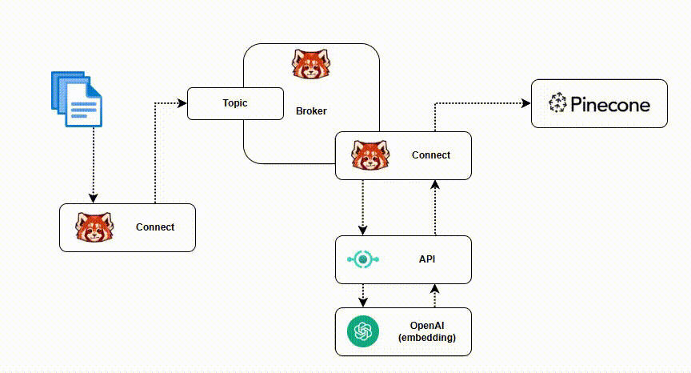

# articles-redpanda-openai-pinecone



### Redpanda CLI'ı kurulum
https://docs.redpanda.com/current/get-started/rpk/


### Windows makina için WSL düzenlemesi
wsl'de çalışıyorsak wsl içindeki /etc/hosts dosyasına aşağıdaki satırları ekliyoruz;
```
127.0.1.1       redpanda
127.0.1.1       my_service
```

wsl içinden docker compose'u çalıştırıyoruz.
```
docker-compose up -d
```

### Redpanda profil oluşturma

docker containerlar çalışmaya başladıktan sonra Redpanda Cli için profil tanımlaması yapalım

```
rpk profile create local
rpk profile set kafka_api.brokers=redpanda:19092,redpanda:29092,redpanda:39092
rpk profile set admin_api.addresses=redpanda:19644,redpanda:29644,redpanda:39644
rpk profile use local
```

first_topic isimli ilk topic'i oluşturuyoruz.

```
rpk topic create first_topic
```

### Ek gereksinimler

Pinecone ve OpenAI Api Key'leri için her ikisinde de hesabımız yoksa hesap açarak her ikisinden API KEY'leri edinmeniz gerekiyor. .rpenv dosyasında ve openai_api fast api projesindeki APIKEY ile ilgili kodlarda düzenleme yapılması gerekiyor.

### Source Connector

```
cd src/redpanda_connect
rpk connect run -e .rpenv fake-converter.yaml
```

### Sink Connector

```
cd src/redpanda_connect
rpk connect run -e .rpenv vektor-converter.yaml
```